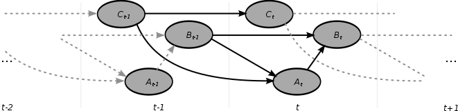
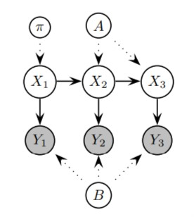
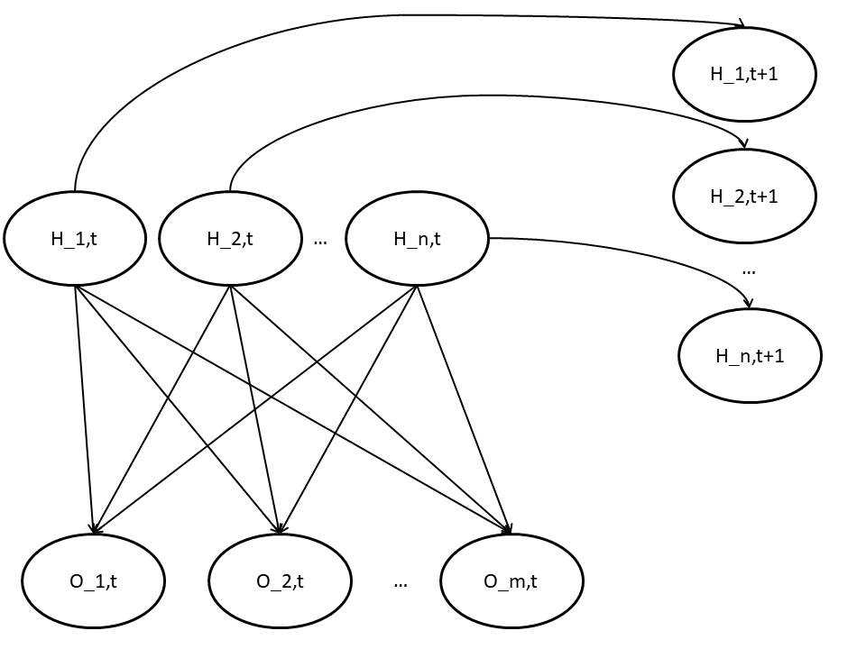
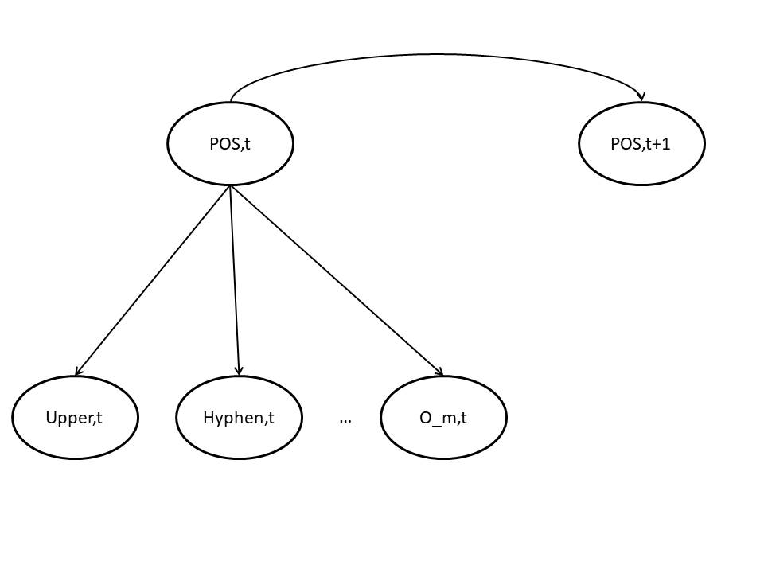

# Tarea #6 Red Bayesiana Dinámica (RBD)

- Luis Ernesto Ibarra Vázquez C511
- Luis Enrique Dalmau Coopat C511

## Descripción Teórica de RBD

### Representación

Las RBD son una extensión de las RB para modelar ditribuciones de probabiliad de secuencias sobre una colección semi-infinitas de variables aleatorias. El término dinámico se refiere a que se modela un sistema dinámico, no que la red cambia con el tiempo, aunque existen modelos que pueden hacerlo. Para la representación del instante de tiempo, las variables se sufijan con el número correspondiente a este.

Una RBD esta compuesta por un par (B1, B_arrow) en donde B1 define la distribución del estado inicial en el tiempo y B_arrow es una two-slice Temporal Bayes Network (2TBN) que define la transición entre el estado Z\_{t-1} al Z_t, o sea P(Z_t|Z\_{t-1}), esta es representada por un grafo dirigido acíclico. La definición anterior trae implícita la propiedad Markoviana de las RBD entre diferentes tiempos, (Z\_{t+1} \_|\_ Z\_{t-1} | Z_{t}).

$$
P(Z_t|Z_{t-1}) = \Pi_{i=1}^{N} P(Z_t^i|Pa(Z^i_t))
$$

Donde Z_t^i es el i-ésimo nodo en tiempo t.

En la figura anterior se representa una posible definición de una B_arrow de una RBD.

Generalmente las variables Z_t se dividen en tres grupos, variables ocultas X_t, variables observables Y_t y variables de control U_t. Las variables ocultas son estados no observados en el proceso modelado, las variables observables son estados observados del proceso y las variables de control son estados impuestos por medios externos al modelo que pueden influenciar las variables ocultas de este.

Los Modelos Ocultos de Markov (MOM) y los Modelos Filtros de Kalman (MFK) son casos específicos de estas, demostrando así su gran poder expresivo de las RBD.

**Modelo Oculto de Markov como RBD**

Donde:
- pi: Distribución inicial de X_1
- X_i: Variable Oculta en el time-slice i
- Y_i: Variable Observada en el time-slice i
- A: Matriz estocástica de transición entre Estados Ocultos
- B: Matriz estocástica de observación entre el Estado Oculto y el Estado Observado (Caso Discreto)

**Modelo Filtro de Kalman como RBD**

La representación es similar al MOM, ya que ambos asumen lo mismo, la diferencia radica en que las variables de MFK son variables continuas que distribuyen normal.

### Inferencia

El objetivo de la inferencia en una RBD es el cómputo de P(X-t^i|y_{1:r}). En dependencia del valor de r se dividen en diferentes nombres:

- r = t: Filtrado
- r > t: Suavizado
- r < t: Predicción

Para esto existen diferentes algoritmos:

- Inferencia hacia adelante (Forward Inference)
- Inferencia hacia atrás (Backward Inference)
- Interface

## Descripción Práctica

Las RBD están presentes en el Procesamiento del Lenguaje Natural (PLN). En este campo son usadas en la anotación de etiquetas de partes de la oración o Part of Speech (POS) en inglés. Existen varios conjuntos de etiquetas POS, en este trabajo nos centraremos en etiquetas consideradas universales por los corpus usados:

| Tag  |	Meaning  |	English Examples |
| ---  | ---         | ---      |
| ADJ |	adjective |	new, good, high, special, big, local |
| ADP |	adposition |	on, of, at, with, by, into, under |
| ADV |	adverb |	really, already, still, early, now |
| CONJ |	conjunction |	and, or, but, if, while, although |
| DET |	determiner |, article	the, a, some, most, every, no, which |
| NOUN |	noun |	year, home, costs, time, Africa |
| NUM |	numeral |	twenty-four, fourth, 1991, 14:24 |
| PRT |	particle |	at, on, out, over per, that, up, with |
| PRON |	pronoun |	he, their, her, its, my, I, us |
| VERB |	verb |	is, say, told, given, playing, would |
| . |	punctuation | marks	. , ; ! |
| X |	other |	ersatz, esprit, dunno, gr8, univeristy |

El problema anterior consiste en dado una secuencia de tokens, devolver cada token anotado con su etiqueta POS correspondiente. Por ejemplo:

| El  | perro | peludo | ladra | y | juega |
| --- | ---   | ---    | ---   |---| ---   |
| DET | NOUN  | ADJ    | VERB  |CONJ | VERB |

Este tipo de anotación es usado como atributos en múltiples tareas de PLN por lo que tiene una gran importancia teórica y práctica.

### Modelación

Se creó un algoritmo que generaliza el anotado de POS para una estructura particular de RBD. En la RBD propuesta las variables se dividen en dos secciones, las variables observadas y las variables ocultas. Las variables observadas corresponden a características de la palabra observada de la secuencia, como por ejemplo su longitud, si empieza con mayúsculas. Las variables ocultas corresponden a características no observadas de la palabra como es el caso de la etiqueta POS de ella. El tiempo se modeló como la posición de la palabra en una oración.

El modelado corresponde al siguiente grafo:

En el modelo se observa la definición de una 2TBN. En el caso particular del problema a resolver existe solo una variable oculta, la etiqueta POS, pero se puede extender a que múltiples variables ocultas con facilidad. La restricción de las variables ocultas (H_i,t) es que solo se conectan con su correspondiente en el intervalo de tiempo siguiente (H_i,t+1) y que se conectan con todas las variables observadas en su intervalo de tiempo (O_i,t). Lo interesante de este modelo es la flexibilidad con que se pueden añadir atributos observables.

El modelo concreto implementado se observa en la siguiente figura, añadiendo la posibilidad de agregar nuevos atributos:

### Software

Para la implementación del modelo nos basamos en la biblioteca **pgmpy**. En este usamos las definiciones de Red Bayesiana y de Red Dinámica Bayesianas ya implementadas, además de los algoritmos de inferencia que actúan sobre ellas. Para la obtención del corpus nos basamos en **nltk**, en esta biblioteca existen múltiples conjuntos de datos con oraciones que tienen las etiquetas POS anotadas. Particularmente nos concentramos en el corpus Brown, el cual es una colección de muestras de textos en inglés americano estructurado en varios géneros.

### Resultados

El conjunto de variables observadas elegido fue un sencillo conjunto de dos variables, estas son si la letra comienza con mayúscula y si la palabra contiene un - en ella. Se entrenó el modelo con el corpus de Brown de nltk. El resultado fue una precisión del 40%. Aunque resultado es bajo con respecto al estado del arte del problema que se encuentra por encima del 95%, es superior a un anotador random, el cual con el conjunto universal de etiquetas alcanzaría aproximadamente un 8% (1/|Cantidad de etiquetas POS|).

Luego se realizó una mejora al modelo agregándole más información sobre las palabras por medio de añadirle más variables observadas. Las agregadas fueron las variables si la palabra es un número y si la palabra contiene un signo de puntuación. Con esta modificación se logró alcanzar un 50% de precisión en las pruebas.

Los resultados anteriores puede ser posible mejorarlos con la investigación de un conjunto de atributos que puedan ayudar a mejorar la identificación de las variables ocultas. Esto se pudo observar en la modificación al agregarle las variables en el segundo experimento. 

## Referencias

- Dynamic Bayesian Networks: Representation, Inference and Learning (Suresh Babu)
- https://www.nltk.org/book/ch05.html
- Probabilistic Graphical Models Principles and Techniques MIT 2009
- https://pgmpy.org/exact_infer/dbn_infer.html
- https://pgmpy.org/param_estimator/mle.html
- https://pgmpy.org/param_estimator/bayesian_est.html
- https://en.wikipedia.org/wiki/Brown_Corpus